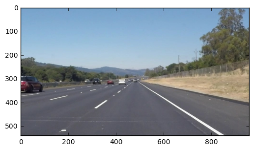
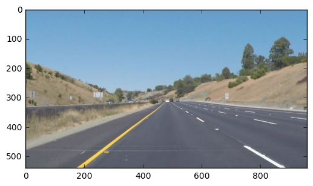
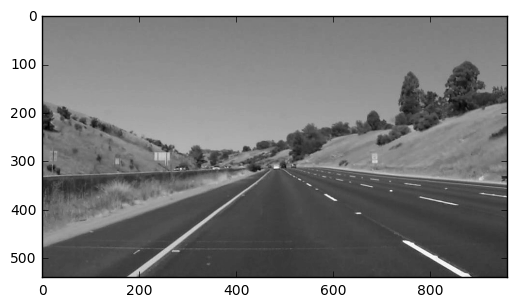
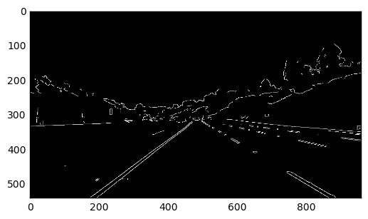
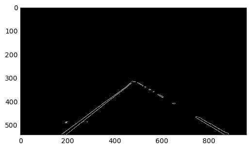
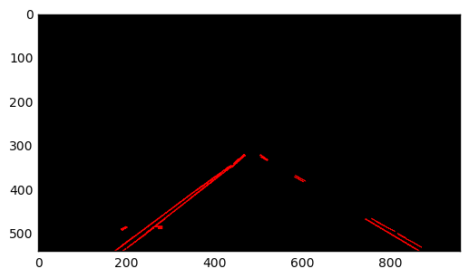
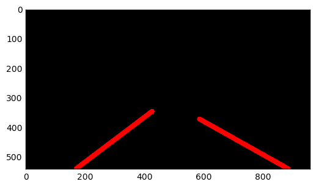
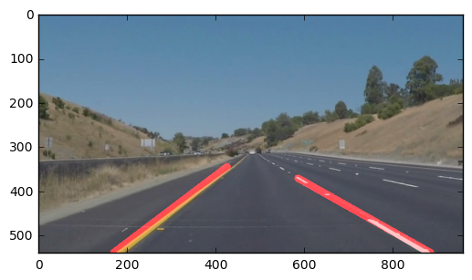

# **Detecting Lane Lines on the Road** 

***

In this project we use OpenCV and matplotlib to work with images and video taken from a dashboard camera of a moving vehicle in a road.

The goal is to detect the lanes and make an overlay that outlines the lanes as the vehicle is moving.

We start by building an image processing pipeline that detects the lane in a single image, and then apply this pipeline to every frame of a video feed.

You can see the result in the white.mp4 video file.

***

```python
#importing some useful packages
import matplotlib.pyplot as plt
import matplotlib.image as mpimg
import numpy as np
import cv2
%matplotlib inline
```


```python
#reading in an image
image = mpimg.imread('test_images/solidWhiteRight.jpg')
#printing out some stats and plotting
print('This image is:', type(image), 'with dimesions:', image.shape)
plt.imshow(image)  # if you wanted to show a single color channel image called 'gray', for example, call as plt.imshow(gray, cmap='gray')
```

    This image is: <class 'numpy.ndarray'> with dimesions: (540, 960, 3)


    <matplotlib.image.AxesImage at 0x112456b00>





```python
import math

def grayscale(img):
    """Applies the Grayscale transform
    This will return an image with only one color channel
        
def canny(img, low_threshold, high_threshold):
    """Applies the Canny transform"""
    return cv2.Canny(img, low_threshold, high_threshold)

def gaussian_blur(img, kernel_size):
    """Applies a Gaussian Noise kernel"""
    return cv2.GaussianBlur(img, (kernel_size, kernel_size), 0)

def region_of_interest(img, vertices):
    """
    Applies an image mask.
    
    Only keeps the region of the image defined by the polygon
    formed from `vertices`. The rest of the image is set to black.
    """
    #defining a blank mask to start with
    mask = np.zeros_like(img)   
    
    #defining a 3 channel or 1 channel color to fill the mask with depending on the input image
    if len(img.shape) > 2:
        channel_count = img.shape[2]  # i.e. 3 or 4 depending on your image
        ignore_mask_color = (255,) * channel_count
    else:
        ignore_mask_color = 255
        
    #filling pixels inside the polygon defined by "vertices" with the fill color    
    cv2.fillPoly(mask, vertices, ignore_mask_color)
    
    #returning the image only where mask pixels are nonzero
    masked_image = cv2.bitwise_and(img, mask)
    return masked_image

def draw_vertices(img, points, color=[255,0,0], thickness=2):
    """Debugging help function to draw the region polygon"""
    #print(points)
    cv2.line(img, points[0], points[1], color, thickness)
    cv2.line(img, points[1], points[2], color, thickness)
    cv2.line(img, points[2], points[3], color, thickness)

def extrapolate_to_y(x1,y1,x2,y2 ,Y2, maxY):
    """Takes two points and extrapolates the line between them to a given Y coordinate"""
    
    #If the line is vertical, X2 is the same as X1
    if(x2-x1 == 0):
        return (x1,Y2)
    
    #Get slope from given line
    m = ( (maxY-y2)-(maxY-y1) ) / (x2-x1)
    #print('Extrapolation Slope:',(maxY-y2),(maxY-y1),x2,x1)
    
    #Calculate X2 for given Y2
    X2 = int( ( ((maxY-Y2)-(maxY-y1))/m ) + x1 )
    #print('Extrapolation X2:',((maxY-Y2)-(maxY-y1)),m,x1)
    
    return (X2,Y2)

def get_merged_lines(lines, side, maxY):
    """Takes a set of lines and returnes the averaged extrapolated line for them"""
    X1 = 0
    Y1 = 0
    Y2 = 0
    X2 = 0
    x1Avg = 0
    y1Avg = 0
    x2Avg = 0
    y2Avg = 0
    
    #Loop all lines finding extreme points and positions average
    for x1,y1,x2,y2 in lines:
        x1Avg = x1Avg + x1
        y1Avg = y1Avg + y1
        x2Avg = x2Avg + x2
        y2Avg = y2Avg + y2
        if(X1 == 0 or x1 < X1):
            X1 = x1
            Y1 = y1
        if(side == 'left' and (Y2 == 0 or y2 < Y2)):
            X2 = x2
            Y2 = y2
        if(side == 'right' and (Y2 == 0 or y2 > Y2)):
            X2 = x2
            Y2 = y2
    x1Avg = int(x1Avg/len(lines))
    y1Avg = int(y1Avg/len(lines))
    x2Avg = int(x2Avg/len(lines))
    y2Avg = int(y2Avg/len(lines))    
    
    #Define direction of the extrapolation depending which lane line we are dealing with
    if(side == 'left'):
        projectionPoint1 = maxY
        projectionPoint2 = Y2

    if(side == 'right'):
        projectionPoint1 = Y1
        projectionPoint2 = maxY
    
    #Extrapolate the line accordingly
    ex1, ey1 = extrapolate_to_y(x1Avg,y1Avg,x2Avg,y2Avg, projectionPoint1, maxY)
    ex2, ey2 = extrapolate_to_y(x1Avg,y1Avg,x2Avg,y2Avg, projectionPoint2, maxY)
    
    return (ex1,ey1,ex2,ey2)

def draw_merged_lines(img, lines, color=[255, 0, 0], thickness=2):
    """Takes an image and the lines detected and draws the lane markup """
    leftLines = []
    rightLines = []
    middlePoint = img.shape[1]/2
    middleWindow = 35
    #print('Finding left and right lines:', img.shape)
    #print(len(lines))
    
    #Loop all lines, classifing them to left or right lane lines
    #The determined side is defined by their slope and their position in the 
    #horizonal space
    for line in lines:
        for x1,y1,x2,y2 in line:
            
            if(x2-x1 != 0):
                m = ( (img.shape[0]-y2)-(img.shape[0]-y1) ) / (x2-x1)
                if(m >= 0.5 and x1 < (middlePoint-middleWindow) and x2 <(middlePoint-middleWindow)):
                    #print('Left Slope:',(x1,y1,x2,y2), '[', (img.shape[0]-y2), '-',(img.shape[0]-y1),'/',x2-x1,' ] = ',m)
                    leftLines.append((x1,y1,x2,y2))
                if(m <= -0.5 and x1 > (middlePoint+middleWindow) and x2 > (middlePoint+middleWindow)):
                    #print('right Slope:',(x1,y1,x2,y2), '[', (img.shape[0]-y2), '-',(img.shape[0]-y1),'/',x2-x1,' ] = ',m)
                    rightLines.append((x1,y1,x2,y2))
    #print('Found left lines', len(leftLines))
    #print(leftLines)
    #print('Found right lines', len(rightLines))
    #print(rightLines)

    #Once classified, merge them into one (average) and draw them on the image
    if(len(leftLines) > 0):
        x1,y1,x2,y2 = get_merged_lines(leftLines, 'left', img.shape[0])
        cv2.line(img, (x1, y1), (x2, y2), color, thickness)
    if(len(rightLines) > 0):
        x1,y1,x2,y2 = get_merged_lines(rightLines, 'right', img.shape[0])
        cv2.line(img, (x1, y1), (x2, y2), color, thickness)
        
def draw_lines(img, lines, color=[255, 0, 0], thickness=2):
    """Draws the given lines on the reference image """
    for line in lines:
        for x1,y1,x2,y2 in line:
            cv2.line(img, (x1, y1), (x2, y2), color, thickness)
            
def get_hough_lines(img, rho, theta, threshold, min_line_len, max_line_gap):
    """Finds the hough lines in an image """
    lines = cv2.HoughLinesP(img, rho, theta, threshold, np.array([]), minLineLength=min_line_len, maxLineGap=max_line_gap)
    return lines

def draw_hough_lines(img, rho, theta, threshold, min_line_len, max_line_gap, merged=False):
    """Returns an image with hough lines drawn."""
    lines = get_hough_lines(img, rho, theta, threshold, min_line_len, max_line_gap)
    line_img = np.zeros((img.shape[0], img.shape[1], 3), dtype=np.uint8)
    if(merged):
        draw_merged_lines(line_img, lines, thickness=16)
    else:
        draw_lines(line_img, lines)
    return line_img

def weighted_img(img, initial_img, α=0.8, β=1., λ=0.):
    """
    `img` is the output of the hough_lines(), An image with lines drawn on it.
    Should be a blank image (all black) with lines drawn on it.
    
    `initial_img` should be the image before any processing.
    
    The result image is computed as follows:
    
    initial_img * α + img * β + λ
    NOTE: initial_img and img must be the same shape!
    """
    return cv2.addWeighted(initial_img, α, img, β, λ)
```

## Test on Images

Now we build our pipeline to work on the images in the directory "test_images"  

```python
import os
os.listdir("test_images/")
```


    ['solidWhiteCurve.jpg',
     'solidWhiteRight.jpg',
     'solidYellowCurve.jpg',
     'solidYellowCurve2.jpg',
     'solidYellowLeft.jpg',
     'whiteCarLaneSwitch.jpg']


We run the solution on all test_images 


```python
### IMAGE PROCESSING PIPELINE ####

### 1 Reading the image
#image = mpimg.imread('test_images/solidWhiteRight.jpg')    #1
#image = mpimg.imread('test_images/solidWhiteCurve.jpg')    #2
#image = mpimg.imread('test_images/solidYellowLeft.jpg')    #3
#image = mpimg.imread('test_images/solidYellowCurve.jpg')   #4
#image = mpimg.imread('test_images/solidYellowCurve2.jpg')  #5
image = mpimg.imread('test_images/whiteCarLaneSwitch.jpg') #6
image_shape = image.shape
print('This image is:', type(image), 'with dimesions:', image_shape) 
plt.figure()
plt.imshow(image)

### 2 Get a grayscale representation 
image_gray = grayscale(image)
plt.figure()
plt.imshow(image_gray, cmap='gray')

### 3 Apply canny transform to detect edges
image_edges = canny(image_gray, 150, 220) 
plt.figure()
plt.imshow(image_edges, cmap='Greys_r')

### 4 Get the region of interest
points = [(0,image_shape[0]),(int(image_shape[1]/2), int(image_shape[0]/2)+40), (int(image_shape[1]/2), int(image_shape[0]/2)+40), (image_shape[1],image_shape[0])]
#Draw the vertices of the region of interest, for debugging
    #draw_vertices(image_edges, points)
    #plt.figure()
    #plt.imshow(image_edges, cmap='Greys_r')
poly_vertices = np.array([points], dtype=np.int32)
image_region = region_of_interest(image_edges, poly_vertices)
plt.figure()
plt.imshow(image_region, cmap='Greys_r')

### 5 Draw the hough lines 
image_lines = draw_hough_lines(image_region, 2, np.pi/180, 20, 10, 3)
plt.figure()
plt.imshow(image_lines)

### 6 Draw the merged lines
image_merged_lines = draw_hough_lines(image_region, 2, np.pi/180, 20, 10, 3, merged=True)
plt.figure()
plt.imshow(image_merged_lines)

### 7 Combine the merged lines on top of the original image
image_markup = weighted_img(image_merged_lines, image)
plt.figure()
plt.imshow(image_markup)


```

    This image is: <class 'numpy.ndarray'> with dimesions: (540, 960, 3)


    <matplotlib.image.AxesImage at 0x1136b99e8>























## Test on Videos

What's cooler than drawing lanes over images? Drawing lanes over video!

We can test our solution on two provided videos:

`solidWhiteRight.mp4`

`solidYellowLeft.mp4`


```python
# Import everything needed to edit/save/watch video clips
from moviepy.editor import VideoFileClip
from IPython.display import HTML
```


```python
def process_image(image):
    '''Process each individual image and return that image with lane markup'''
    image_shape = image.shape
    
    #Get grayscale representation
    image_gray = grayscale(image)
    
    #Apply canny transform to detect edges
    image_edges = canny(image_gray, 50, 100) 
    
    #Draw the region of interest alone
    points = [(0,image_shape[0]),(int(image_shape[1]/2), int(image_shape[0]/2)+40), (int(image_shape[1]/2), int(image_shape[0]/2)+40), (image_shape[1],image_shape[0])]
    poly_vertices = np.array([points], dtype=np.int32)
    image_region = region_of_interest(image_edges, poly_vertices)
    
    # Draw the merged lines
    image_merged_lines = draw_hough_lines(image_region, 2, np.pi/180, 20, 10, 3, merged=True)
    
    #Draw Markup
    image_markup = weighted_img(image_merged_lines, image)

    return image_markup
```

Let's try the one with the solid white lane on the right first ...


```python
white_output = 'white.mp4'
clip1 = VideoFileClip("solidWhiteRight.mp4")
white_clip = clip1.fl_image(process_image) #NOTE: this function expects color images!!
%time white_clip.write_videofile(white_output, audio=False)
```

    [MoviePy] >>>> Building video white.mp4
    [MoviePy] Writing video white.mp4


    100%|█████████▉| 221/222 [00:05<00:00, 32.16it/s]


    [MoviePy] Done.
    [MoviePy] >>>> Video ready: white.mp4 
    
    CPU times: user 2.54 s, sys: 208 ms, total: 2.75 s
    Wall time: 6.41 s


<video width="960" height="540" controls>
  <source src="white.mp4">
</video>


Now for the one with the solid yellow lane on the left. This one's more tricky!


```python
yellow_output = 'yellow.mp4'
clip2 = VideoFileClip('solidYellowLeft.mp4')
yellow_clip = clip2.fl_image(process_image)
%time yellow_clip.write_videofile(yellow_output, audio=False)
```

    [MoviePy] >>>> Building video yellow.mp4
    [MoviePy] Writing video yellow.mp4


    100%|█████████▉| 681/682 [00:20<00:00, 35.42it/s]


    [MoviePy] Done.
    [MoviePy] >>>> Video ready: yellow.mp4 
    
    CPU times: user 9.73 s, sys: 780 ms, total: 10.5 s
    Wall time: 21.9 s


```python
HTML("""
<video width="960" height="540" controls>
  <source src="{0}">
</video>
""".format(yellow_output))
```


<video width="960" height="540" controls>
  <source src="yellow.mp4">
</video>


## Reflections


### About this implementation

This final implementation is the result of a continous iteration process. Initially I was using a canny filter that was pretty agressive in finding very clear borders. I was also simply finding the lowest and highest points on each lane side as reference to draw a single line. This was making the lines jump quite a bit left and right. And in particular, while testing with the challenge video, the lines were all over the place, and crossing each other at the upper ends a lot.

After that I improved it by actually doing the positional average of all the lines found on each side. This made the line to be more stable and not jump left and right so much. 

I also changed the logic that classifies them as "left" or "right" by increasing the slope threshold (ignoring more horizonal lines). I also decided to classify them by their relative location to the image (some elements with the "correct" slope were detected in the wrong side of the image). For this I defined a window in the middle of the image, and considered only lines that were fully within each side of the image (outside of the middle window). This helped with the situation where lane markers were crossing each other. Specially in curves.

Finally in the challenge video there is a segment where the road has a very bright colour. This made the detection algorithm to actually loose sight of the left lane completely for that time. To improve this I lowered the threshold in the canny border detection. This made the algorithm to pick up some other unwanted elements on the road, but the averaging approach kept the lines in what I think is a reasonable compromise. Now the left line is detected even in that bright area of the road. 

As I was working on that issue with the bright area on the road, it made me think that a possible way to improve the robustness of the algorithm would be to have a loop in the line detection part, where if the detection renders an empty set of lines, then we try again with some modified version of the parameters (i.e. lower threshold for canny detection). We can repeat this once or twice before giving up and assumming there are no lane lines in sight. This of course would have to be balanced with the performance of doing these detections in real time. 


